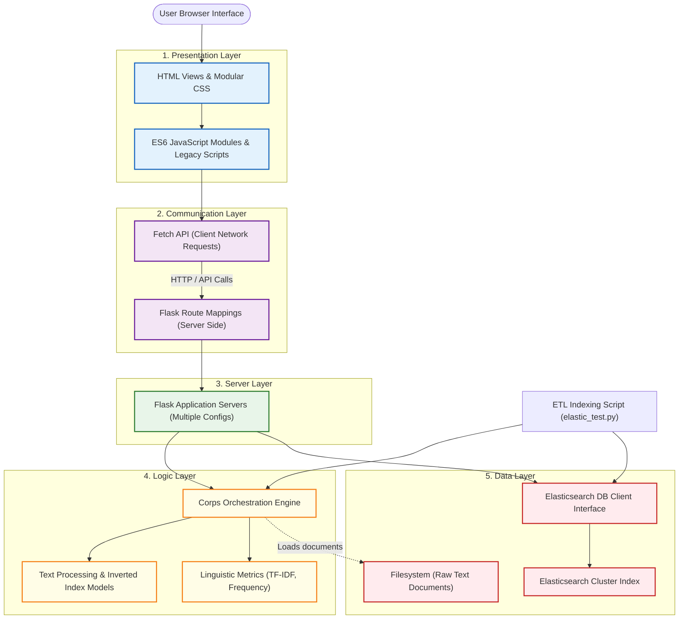
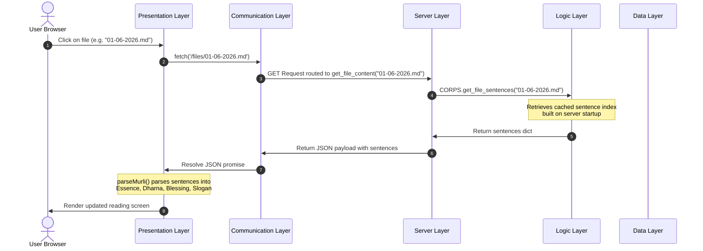

# Project Architectural Layers Analysis

This document outlines the architectural layer map of the **Avyakt Murli Reader and Word Analysis** application. It details how the client-side user interface interacts with the backend services, the natural language processing (NLP) logic, and the persistent data stores (local filesystem and Elasticsearch database).

---

## 1. High-Level Layer Architecture

Below is a diagram representing the layers of the system, illustrating how user requests flow from the frontend through the communication channels to the server components, core logic models, and storage layers.

---

## 2. Detailed Breakdown of Architectural Layers

### 1. Presentation Layer

*   **Purpose**: Renders the user interfaces (web pages, responsive layouts, styled manuscript designs) and coordinates client-side behavior, drag-and-drop interactions, and state updates.
*   **Files**:
    *   **HTML Views**:
        *   [templates/index.html](file:///G:/My%20Drive/VS%20Code%20Projects/Project/templates/index.html) (Main reader view dashboard)
        *   [templates/analysis.html](file:///G:/My%20Drive/VS%20Code%20Projects/Project/templates/analysis.html) (Interactive word frequency & bucket classification board)
        *   [templates/elastic.html](file:///G:/My%20Drive/VS%20Code%20Projects/Project/templates/elastic.html) (Elasticsearch document index table view)
    *   **Modular Stylesheets**:
        *   Directory: [static/css/](file:///G:/My%20Drive/VS%20Code%20Projects/Project/static/css/) (Styling system split into `variables.css`, `reset.css`, `layout.css`, `header.css`, `sidebar.css`, `content.css`, `cards.css`, `buttons.css`, `decorations.css`, `footer.css`, and `responsive.css`)
        *   Page Specific: [static/analysis/analysis.css](file:///G:/My%20Drive/VS%20Code%20Projects/Project/static/analysis/analysis.css)
    *   **Client JavaScript Modules**:
        *   Entry Point: [static/main.js](file:///G:/My%20Drive/VS%20Code%20Projects/Project/static/main.js)
        *   Components: [static/fileList.js](file:///G:/My%20Drive/VS%20Code%20Projects/Project/static/fileList.js) (File navigation), [static/fileViewer.js](file:///G:/My%20Drive/VS%20Code%20Projects/Project/static/fileViewer.js) (Document parsing & parsing points for Dharna, Essence, Blessing, Slogan)
        *   Word Analysis Modules: [static/analysis/analysis.js](file:///G:/My%20Drive/VS%20Code%20Projects/Project/static/analysis/analysis.js), [static/analysis/cards.js](file:///G:/My%20Drive/VS%20Code%20Projects/Project/static/analysis/cards.js), [static/analysis/events.js](file:///G:/My%20Drive/VS%20Code%20Projects/Project/static/analysis/events.js), [static/analysis/render.js](file:///G:/My%20Drive/VS%20Code%20Projects/Project/static/analysis/render.js), [static/analysis/wordManager.js](file:///G:/My%20Drive/VS%20Code%20Projects/Project/static/analysis/wordManager.js)
        *   Elastic Page logic: [static/elastic.js](file:///G:/My%20Drive/VS%20Code%20Projects/Project/static/elastic.js)
        *   Legacy/Backup script: [static/app.js](file:///G:/My%20Drive/VS%20Code%20Projects/Project/static/app.js)
*   **Responsibilities**:
    *   Initialize and manage client-side state parameters (e.g. active view type: original vs extracted, filtered file search string, selected frequency, and favorite/yoga/knowledge word lists).
    *   Register event listeners (clicks, drag-and-drop actions, search bar queries).
    *   Apply visual themes (such as the sunrise sky, rotating lotus designs, manuscript frames, and mobile responsiveness).
    *   Extract structured spiritual text components (Essence, Dharna, Slogans, Blessings) from raw sentence JSON strings on the fly.
*   **Dependencies**: HTML DOM API, CSS Manuscript UI tokens, Browser standard events, and the Communication Layer (requests files/data).
*   **Which layer calls it**: The Browser / End User interactions.
*   **Which layer it calls**: Communication Layer (calling Fetch functions to retrieve data).

---

### 2. Communication Layer

*   **Purpose**: Manages network interactions, serializes API requests/responses, and resolves the routing of REST API endpoints between the frontend UI client and Flask backend server.
*   **Files**:
    *   **Client API Fetch functions**: Embedded inside [static/fileList.js](file:///G:/My%20Drive/VS%20Code%20Projects/Project/static/fileList.js), [static/fileViewer.js](file:///G:/My%20Drive/VS%20Code%20Projects/Project/static/fileViewer.js), [static/elastic.js](file:///G:/My%20Drive/VS%20Code%20Projects/Project/static/elastic.js), [static/analysis/analysis.js](file:///G:/My%20Drive/VS%20Code%20Projects/Project/static/analysis/analysis.js).
    *   **Server Controllers & Routing Table**: The routing functions mapped by decorator `@app.route(...)` in [reaDirectroy.py](file:///G:/My%20Drive/VS%20Code%20Projects/Project/reaDirectroy.py) and [elasticFlask.py](file:///G:/My%20Drive/VS%20Code%20Projects/Project/elasticFlask.py).
*   **Responsibilities**:
    *   Handles AJAX communication asynchronously using native JavaScript `fetch()`.
    *   Converts backend python variables to JSON format (`jsonify`) and maps them to client-side structures.
    *   Parses incoming URL request parameters (such as `filename` and `count`) and maps them to their respective server handlers.
    *   Performs error reporting (handles 404 responses when files cannot be located, or handles malformed network requests).
*   **Dependencies**: Python Flask Routing Decorators, JavaScript Fetch APIs, JSON Serializers/Deserializers.
*   **Which layer calls it**: Presentation Layer (JavaScript modules triggered by user actions).
*   **Which layer it calls**: Server Layer (dispatches calls to backend controller methods).

---

### 3. Server Layer

*   **Purpose**: Boots up the Flask HTTP framework, configures app properties, initializes logic models at startup, and acts as the entry point for serving the web app assets and routing configurations.
*   **Files**:
    *   **Core Server Engine (Directory/Analysis)**: [reaDirectroy.py](file:///G:/My%20Drive/VS%20Code%20Projects/Project/reaDirectroy.py)
    *   **Search Server Engine (Elasticsearch)**: [elasticFlask.py](file:///G:/My%20Drive/VS%20Code%20Projects/Project/elasticFlask.py)
*   **Responsibilities**:
    *   Instantiates Flask application context and sets debug parameters.
    *   Configures local configuration properties like `DIRECTORY_PATH` (where raw Murli text documents are saved).
    *   Performs startup bootstrapping: scans directories, builds a files checklist, instantiates the [Corps](file:///G:/My%20Drive/VS%20Code%20Projects/Project/corps.py) class, and runs the tokenization indexing compilation (`CORPS.build()`) once on server startup.
    *   Integrates with database clients (Elasticsearch instance initialization).
    *   Serves assets from `templates` and `static` directory routes.
*   **Dependencies**: Python `flask` framework, logic layer `Corps` class, database clients.
*   **Which layer calls it**: Communication Layer (routing handler).
*   **Which layer it calls**: Logic Layer (for statistics, word indices, and file sentence payloads), Data Layer (Elasticsearch searching and filesystem scans).

---

### 4. Logic Layer

*   **Purpose**: Encapsulates the domain business logic, document parsing, inverted indexing schemes, linguistic calculations (word frequencies, character bucketing, TF-IDF weights), and metadata schema generation.
*   **Files**:
    *   **Domain Orchestration**: [corps.py](file:///G:/My%20Drive/VS%20Code%20Projects/Project/corps.py)
    *   **Core Business Logic Classes**:
        *   [corpus.py](file:///G:/My%20Drive/VS%20Code%20Projects/Project/corpus.py) (Sentence/Word indexer, token boundary scanner)
        *   [dictionary.py](file:///G:/My%20Drive/VS%20Code%20Projects/Project/dictionary.py) (Unicode normalization and character bucket filters)
        *   [frequency.py](file:///G:/My%20Drive/VS%20Code%20Projects/Project/frequency.py) (Statistics: standard frequencies, document frequencies, TF-IDF calculation)
        *   [sentence.py](file:///G:/My%20Drive/VS%20Code%20Projects/Project/sentence.py) (Helper for original and extracted word boundary string compilation)
        *   [models.py](file:///G:/My%20Drive/VS%20Code%20Projects/Project/models.py) (Position dataclass structures)
*   **Responsibilities**:
    *   Splits files into distinct words while keeping track of word indices and positions.
    *   Tokenizes sentences based on punctuation (Hindi sentence markers `।` and `॥`, exclamation marks, and question marks) and section headers (like "वरदान", "स्लोगन", "गीत", "प्रश्न", "उत्तर").
    *   Extracts normalized word tokens by scrubbing punctuation and standardizing character codes using Unicode NFC normalization.
    *   Calculates relative word frequencies across documents.
    *   Calculates Term Frequency-Inverse Document Frequency (TF-IDF) scores for words, enabling rank indexing.
    *   Presents a standard document model output containing clean fields for search ingestion (`file_name`, `original_sentence`, `sentence_start`, `sentence_end`, `normalized_words`).
*   **Dependencies**: Python standard modules (`math`, `pathlib`, `unicodedata`, `dataclasses`), [regex](https://pypi.org/project/regex/) library, and Data structures.
*   **Which layer calls it**: Server Layer (Flask app views on demand), ETL tooling scripts ([elastic_test.py](file:///G:/My%20Drive/VS%20Code%20Projects/Project/elastic_test.py)).
*   **Which layer it calls**: Data Layer (directly reads local files using `pathlib.Path.read_text`).

---

### 5. Data Layer

*   **Purpose**: Manages connections to persistent external databases (Elasticsearch) and parses incoming files from local directory storage paths.
*   **Files**:
    *   **Client Factory**: [es_client.py](file:///G:/My%20Drive/VS%20Code%20Projects/Project/es_client.py)
    *   **Ingestion Tooling Script**: [elastic_test.py](file:///G:/My%20Drive/VS%20Code%20Projects/Project/elastic_test.py) (ETL pipeline)
    *   **Raw Storage**: Text files located in `G:\My Drive\Obsidian Daily Murli\Daily Murli`
*   **Responsibilities**:
    *   Initializes the connection parameters to Elasticsearch servers (using basic authentication credentials).
    *   Configures system security flags (such as overriding local self-signed SSL/TLS verification using `verify_certs=False` and disabling warning logs).
    *   Handles indexing logic and bulk documents ingestion to the database using Elasticsearch bulk helper libraries.
    *   Retrieves records sorted by files and order boundaries from the Elasticsearch index.
    *   Exposes file readers for loading corpus text files into memory.
*   **Dependencies**: `elasticsearch` Python SDK, `urllib3` (network transport settings), local OS directory filesystem.
*   **Which layer calls it**: Logic Layer (for local file reads), Server Layer (queries Elasticsearch documents), Ingestion scripts ([elastic_test.py](file:///G:/My%20Drive/VS%20Code%20Projects/Project/elastic_test.py) execution).
*   **Which layer it calls**: Elasticsearch server instances and the underlying server filesystem.

---

## 3. Layer Interactions and Data Flow Sequence

Here is how data propagates across layers when a user selects a file for reading:

---

## 4. Architectural Summary Table

| Layer | Primary Role | Key Code Files | Key External Libraries |
| :--- | :--- | :--- | :--- |
| **Presentation** | User interaction & layout styling | [index.html](file:///G:/My%20Drive/VS%20Code%20Projects/Project/templates/index.html), [fileViewer.js](file:///G:/My%20Drive/VS%20Code%20Projects/Project/static/fileViewer.js), stylesheets | Standard HTML/CSS, Vanilla JS |
| **Communication** | Network transfer & route handling | [static/fileList.js](file:///G:/My%20Drive/VS%20Code%20Projects/Project/static/fileList.js), [reaDirectroy.py](file:///G:/My%20Drive/VS%20Code%20Projects/Project/reaDirectroy.py) | Fetch APIs, Flask Routing |
| **Server** | Server bootstrap & request forwarding | [reaDirectroy.py](file:///G:/My%20Drive/VS%20Code%20Projects/Project/reaDirectroy.py), [elasticFlask.py](file:///G:/My%20Drive/VS%20Code%20Projects/Project/elasticFlask.py) | Flask |
| **Logic** | Text tokenization & statistics | [corps.py](file:///G:/My%20Drive/VS%20Code%20Projects/Project/corps.py), [corpus.py](file:///G:/My%20Drive/VS%20Code%20Projects/Project/corpus.py), [frequency.py](file:///G:/My%20Drive/VS%20Code%20Projects/Project/frequency.py) | `regex`, `math`, `unicodedata` |
| **Data** | Disk/Database storage & retrieval | [es_client.py](file:///G:/My%20Drive/VS%20Code%20Projects/Project/es_client.py), [elastic_test.py](file:///G:/My%20Drive/VS%20Code%20Projects/Project/elastic_test.py) | `elasticsearch` SDK, `urllib3` |
