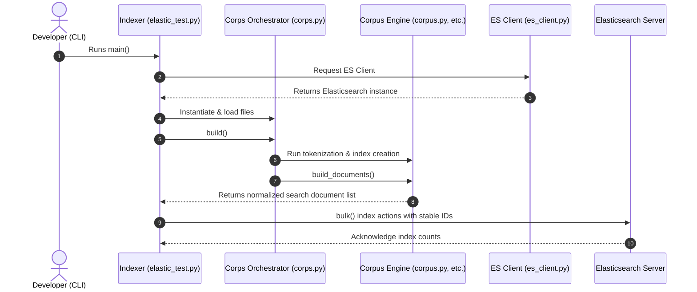
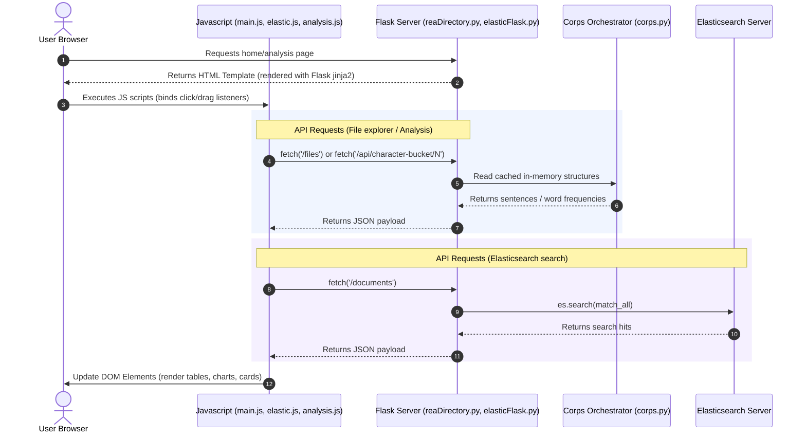

# Module Communication & Responsibilities

This document outlines how the modules inside the project communicate, the call graph relationships, and the specific responsibilities of each module.

---

## 1. Module Communication Flow

The project splits functionality into two primary flows: **Indexing Workflow** (offline/CLI command) and **Web Interface Workflow** (interactive dashboard/search APIs).

### Indexing Workflow Diagram
The indexing workflow parses local document files, processes them through the Corpus engine, and indexes sentences to Elasticsearch:

### Web Dashboard Query Workflow Diagram
The web workflow serves page structures to the client, triggers asynchronous fetch API requests from JavaScript, and gathers index summaries from local cache or Elasticsearch:

---

## 2. Module Responsibilities & Call Mappings

Below is the detailed list of responsibilities and the direct calling connections for each core block:

### A. Web Layer (Flask)
* **Modules**: [reaDirectroy.py](file:///G:/My%20Drive/VS%20Code%20Projects/Project/reaDirectroy.py) and [elasticFlask.py](file:///G:/My%20Drive/VS%20Code%20Projects/Project/elasticFlask.py)
* **Responsibilities**:
  * Acts as the application's HTTP entry point.
  * Manages endpoint routing and handles responses.
  * Links standard browser views to data models.
* **Directly Calls**:
  * [corps.py](file:///G:/My%20Drive/VS%20Code%20Projects/Project/corps.py): To perform in-memory dictionary queries and file lists extraction at startup.
  * [es_client.py](file:///G:/My%20Drive/VS%20Code%20Projects/Project/es_client.py): Creates the search client instance to communicate with the database.

### B. UI Presentation Layer (Templates)
* **Modules**: [index.html](file:///G:/My%20Drive/VS%20Code%20Projects/Project/templates/index.html), [elastic.html](file:///G:/My%20Drive/VS%20Code%20Projects/Project/templates/elastic.html), [analysis.html](file:///G:/My%20Drive/VS%20Code%20Projects/Project/templates/analysis.html)
* **Responsibilities**:
  * Structures user controls (search inputs, drag-and-drop workspace buckets, toggle buttons).
  * Loads associated style assets and front-end JS modules.
* **Directly Calls**:
  * Loads and executes JavaScript file entries.

### C. Client Script Layer (JavaScript)
* **Modules**:
  * [app.js](file:///G:/My%20Drive/VS%20Code%20Projects/Project/static/app.js) / [main.js](file:///G:/My%20Drive/VS%20Code%20Projects/Project/static/main.js)
  * [elastic.js](file:///G:/My%20Drive/VS%20Code%20Projects/Project/static/elastic.js)
  * [analysis/analysis.js](file:///G:/My%20Drive/VS%20Code%20Projects/Project/static/analysis/analysis.js) and support scripts ([cards.js](file:///G:/My%20Drive/VS%20Code%20Projects/Project/static/analysis/cards.js), [events.js](file:///G:/My%20Drive/VS%20Code%20Projects/Project/static/analysis/events.js), [render.js](file:///G:/My%20Drive/VS%20Code%20Projects/Project/static/analysis/render.js), [wordManager.js](file:///G:/My%20Drive/VS%20Code%20Projects/Project/static/analysis/wordManager.js))
* **Responsibilities**:
  * Intercepts browser actions (clicks, drags, search keyboard input).
  * Makes asynchronous background network requests (`fetch()`) to retrieve server configurations.
  * Manages UI state changes and updates DOM components dynamically.
* **Directly Calls**:
  * Renders elements and registers callbacks on the browser window.
  * Communicates with Flask backend API endpoints.

### D. Data Indexing Script (Indexer)
* **Modules**: [elastic_test.py](file:///G:/My%20Drive/VS%20Code%20Projects/Project/elastic_test.py)
* **Responsibilities**:
  * Parses arguments (such as recreate flags).
  * Scans raw directory files.
  * Processes sentences and bulk indexes records into Elasticsearch database with stable IDs.
* **Directly Calls**:
  * [corps.py](file:///G:/My%20Drive/VS%20Code%20Projects/Project/corps.py): Runs load words and builds full corpus indexes.
  * [es_client.py](file:///G:/My%20Drive/VS%20Code%20Projects/Project/es_client.py): Establishes authentication.

### E. Corpus Orchestration Engine (Corpus)
* **Modules**: [corps.py](file:///G:/My%20Drive/VS%20Code%20Projects/Project/corps.py)
* **Responsibilities**:
  * Acts as a single entry point for the backend logic.
  * Coordinates internal builds of indices.
* **Directly Calls**:
  * [corpus.py](file:///G:/My%20Drive/VS%20Code%20Projects/Project/corpus.py): Executes tokenization, sentence indexes, and raw word indexing.
  * [dictionary.py](file:///G:/My%20Drive/VS%20Code%20Projects/Project/dictionary.py): Normalizes Unicode character buckets.
  * [sentence.py](file:///G:/My%20Drive/VS%20Code%20Projects/Project/sentence.py): Rebuilds original texts from index arrays.
  * [frequency.py](file:///G:/My%20Drive/VS%20Code%20Projects/Project/frequency.py): Generates IDF and TF-IDF statistics.

### F. Elasticsearch Database & Search Connector (Search)
* **Modules**: [es_client.py](file:///G:/My%20Drive/VS%20Code%20Projects/Project/es_client.py)
* **Responsibilities**:
  * Initializes the `Elasticsearch` client instance.
  * Applies verification configurations (e.g., verifying SSL certificates and basic auth).
* **Directly Calls**:
  * Elasticsearch API endpoints.
